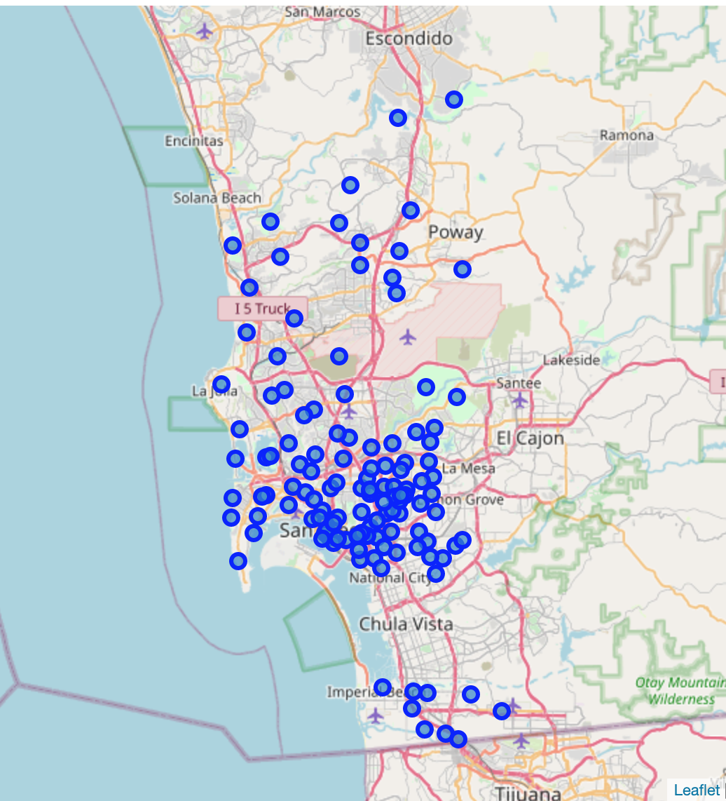
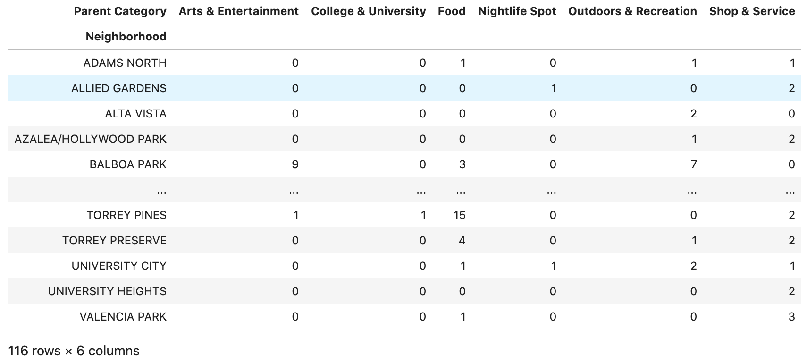
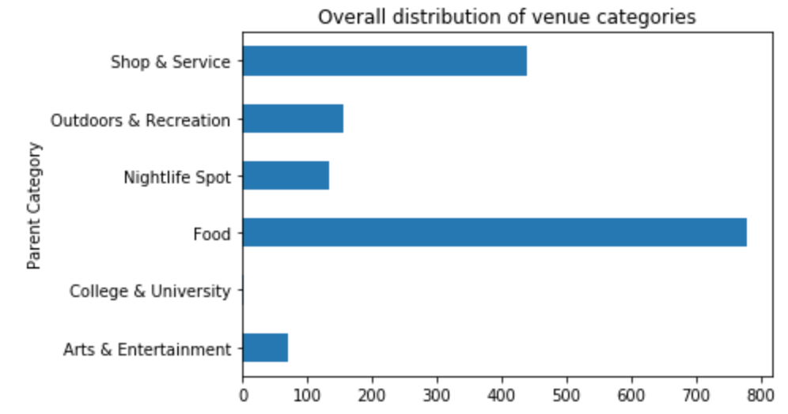
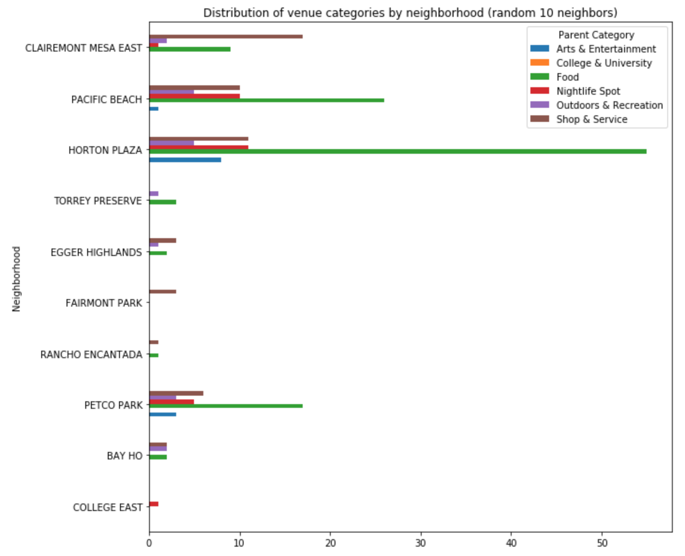

# The Battle of Neighborhoods
## Coursera's "Applied Data Science Capstone" Project - Weeks 4 and 5 Assignment

**Student:** Michael Onishi  
**Date:** June 2020

https://www.coursera.org/learn/applied-data-science-capstone

## 1 - Introduction

This is the final assignment from the Coursera's "Applied Data Science Capstone" course. In this project we are required to: 
> come up with an idea to leverage the Foursquare location data to explore or compare neighborhoods or cities of your choice or to come up with a problem that you can use the Foursquare location data to solve.

For this project, I will build a model that recommends neighborhoods of San Diego/California to someone based on his/her interest. So it may be used by someone looking for a place to live in San Diego or just going there for tourism.

The user will give a weight to each of the following categories (all of them are top level venue categories from Foursquare):

 * Arts & Entertainment
 * College & University
 * Food
 * Nightlife Spot
 * Outdoors & Recreation
 * Shop & Service
 
Based on this profile, the system will recommend neighborhoods that get the best scores.

Although I am Brazilian, I chose San Diego because it appears to be a city well covered in Foursquare and I fell in love with it when I went there some years ago.

## 2 - Data

To get the neighborhood location data, I used data from San Diego Open Data Portal: https://data.sandiego.gov/datasets/pd-neighborhoods/ .

As mencioned there, _"These boundaries are for law enforcement only and do not represent legal neighborhood or community boundaries."_ But it represents pretty well the official neighborhoods, so I used it in this project.

There are 124 total neighborhoods in total from this dataset.

Then I got venues information for every neighborhood using the Foursquare API. The most important data was the top level category for each venue.

## 3 - Methodology

The neighborhoods dataset was in geojson format. So I had to transform each polygon data into only one latitude/longitude coordinate. To get a representative coordinate, my approach was to have a mean of all the polygon points. To test if it was appropriate, I used the folium library to show a map of San Diego with a marker for each neighborhood. The generated map is below:

After that, I used the Foursquare API to get a list of venues for each neighborhood. One thing worth noting is that the [explore API](https://developer.foursquare.com/docs/api-reference/venues/explore/) did not work well passing the <code>categoryId</code> parameter. I tried to pass a list of comma separated IDs for the 6 selected categories, but the API only returned venues for the first category in the list (Arts & Entertainment).

So I had to get a list of all the venues, and filter later only the categories I needed. Because the API returns the most detailed category from each venue, I had to process it to get the respective top most parent category. For example, "Football Stadium" category should be transformed into "Arts & Entertainment"; "Dog Run" should be transformed into "Outdoors & Recreation". For this transformation, I got the category hierarchy data from the [Venue Categories API](https://developer.foursquare.com/docs/build-with-foursquare/categories/).

The next step was aggregating the data for each neighborhood and category. The resulting dataframe is shown bellow:

Then I plotted some distributions to explore the data. First an overall distribution for the venue categories:

Now a distribution of categories by 10 random neighborhoods:

After that I created 3 profiles to know how the recommendation engine would perform. Each of the selected categories may have any desired weight based on the users' preferences.

##### Profile 1: Young single men looking for fun.
<pre>
Arts & Entertainment = 6
College & University = 4
Food = 2
Nightlife Spot = 10
Outdoors & Recreation = 5
Shop & Service = 2
</pre>

#####  Profile 2: A stable mid-aged couple looking for living in the city.
<pre>
Arts & Entertainment = 7
College & University = 0
Food = 6
Nightlife Spot = 2
Outdoors & Recreation = 5
Shop & Service = 6
</pre>

##### Profile 3: An retired woman looking for peace
<pre>
Arts & Entertainment = 7
College & University = -1
Food = 5
Nightlife Spot = -5
Outdoors & Recreation = 10
Shop & Service = 5
</pre>

With the profiles set, I recommended the top neighborhoods for each of them using cosine similarity. Used the cosine similarity measure to make sure the disparity on the number of venues do not interfered in the score. It also maked it possible to the user to choose any range of weights for the categories.

So we are using a content-based filtering recommendation system, since we already have the user preferences and try to recommend similar items based on these preferences.

## 4 - Results
After calculating the cosine similarity scores for each profile, we got the following:

#### Top 5 neighborhood recommendations for each profile and cosine similarity scores

##### Profile 1
<pre>
Neighborhood
SERRA MESA         0.778078
ALLIED GARDENS     0.735215
COLLEGE EAST       0.735215
UNIVERSITY CITY    0.666924
SOUTH PARK         0.660330
</pre>

##### Profile 2
<pre>
Neighborhood
ADAMS NORTH    0.979796
LINDA VISTA    0.895669
SAN YSIDRO     0.835573
QUALCOMM       0.833333
CORTEZ         0.818165
</pre>

##### Profile 3
<pre>
Neighborhood
ADAMS NORTH      0.900000
SAN CARLOS       0.870930
BALBOA PARK      0.864460
LOGAN HEIGHTS    0.812362
OCEAN CREST      0.801388
</pre>

#### Bottom 5 neighborhood for each profile and cosine similarity scores
##### Profile 1
<pre>
Neighborhood
JAMACHA LOMITA    0.147043
EMERALD HILLS     0.147043
SKYLINE           0.147043
TALMADGE          0.147043
PARADISE HILLS    0.147043
</pre>

##### Profile 2
<pre>
Neighborhood
ALLIED GARDENS    0.163299
COLLEGE EAST      0.163299
ROLANDO           0.408248
LAKE MURRAY       0.408248
NESTOR            0.408248
</pre>

##### Profile 3
<pre>
Neighborhood
COLLEGE EAST      -0.333333
ALLIED GARDENS    -0.333333
MIDWAY DISTRICT    0.320750
NORMAL HEIGHTS     0.329287
EMERALD HILLS      0.333333
</pre>

The results were quite interesting, because we could clearly see different recommendations based on these 3 profiles.

## 5 - Discussion
Looking into the results, even using only some of the top level venue categories, the recommendation system could be a lot more accurate if there were more venue data from San Diego. With 124 neighborhoods, we could get only 1705 venues inside them. So my initial assumption that San Diego was well covered by Foursquare was wrong. Maybe working with larger areas than neighborhoods and expanding the radius to search would give more interesting results.

If we had a large collection of venue data, we could explore this idea deeper by allowing the user to select finer grained venue categories to match better their profile.

## 6 - Conclusion
This project was very interesting, because it involved getting data from a official data portal, cleaning and manipulating location data, using commercial API to enrich our data (including overcoming problems with the API itself) and finally doing something potencially useful using a type of recommendation system.

Of course, there are room for many improvements, but for an initial experimentation, I am pleased with the results.